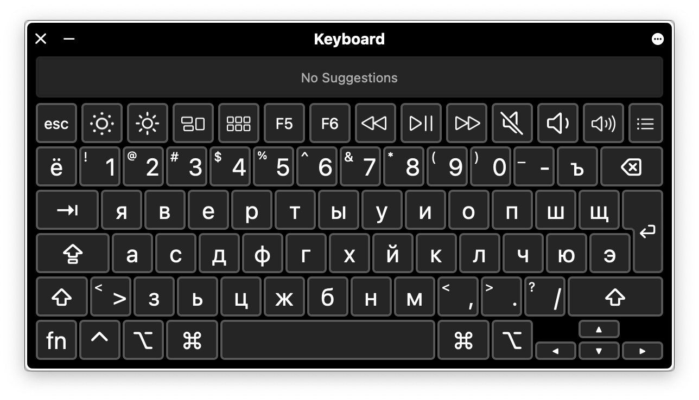
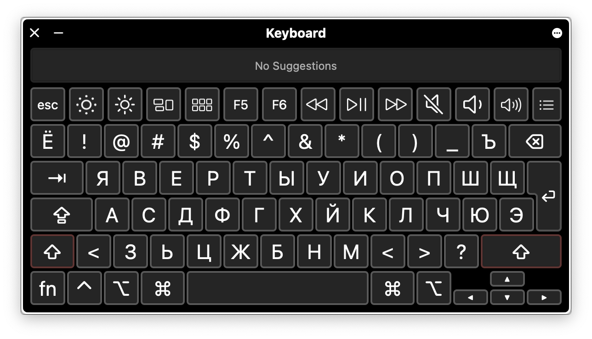
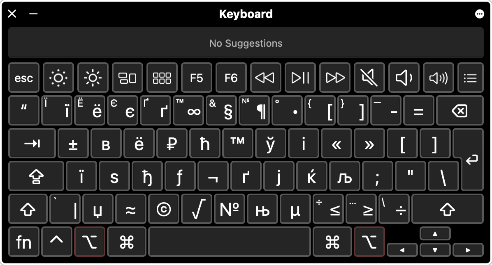

### RU-YAWERTY

Продуктивная раскладка клавиатуры для Mac OS.

> Я давно разучился печатать на ЙЦУКЕН поэтому однажды мне пришлось перенести любимую раскладку на Mac. 

Mac OS из коробки предоставляет своё изобретение - раскладку "ЯШЕРТЫ", которая ни где более не используется.

- Подходит айтишникам и тем кто много печатает на латинице.
- Совместима с аналогичной раскладкой на Linux.
- Если на английском печатаешь "в слепую", а по русски не можешь стоит попробовать эту раскладку вместо яЙЦУКЕНа.

## Скриншоты

> IDLE

> SHIFT

> OPTION

